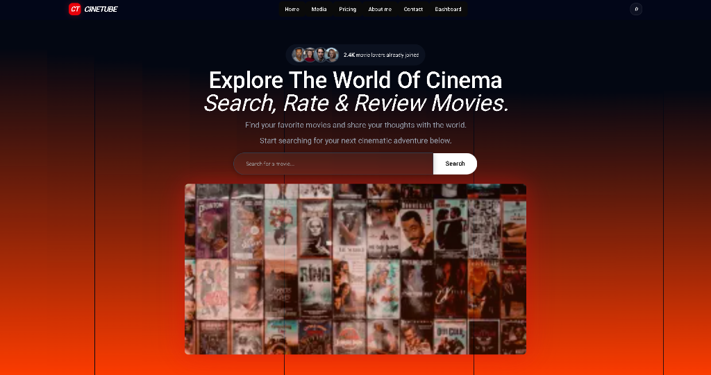

# 🚀 CineTube Server - Backend REST API & Database Gateway

The CineTube Server is a robust, high-performance RESTful API built on the Express 5 framework using the Prisma toolkit. It functions as the secure backbone for CineTube, powering data validation, stateful user sessions, media listing metadata, administrative panels, email dispatching, and secure billing checkout hooks.

---

## ✨ Key Features

- **Advanced Role-Based Security**: Built-in authorization middleware checks targeting `checkAuth(Role.ADMIN, Role.SUPER_ADMIN)` restricting routes to authorized team roles.
- **Better Auth Integration**: State-of-the-art authentication handler wrapping OAuth2, email verification, and token updates.
- **Relational Data Mapping**: Strongly-typed model designs managing tags, reviews, comments, watchlists, billing packages, and custom contact feedback logs.
- **Stripe Webhook Processing**: Asynchronous webhook listening endpoint updating database states dynamically on successful billing checkout actions.
- **Clean QueryBuilder Support**: Custom query compiler supporting advanced pagination, searching, sorting, and tag relations filtering.
- **Data Validation Layer**: Strict Zod schema validator intercepting request payloads before hitting route controller handlers.
- **Email SMTP Delivery**: Automated mail dispatch using Nodemailer integrations to support validation actions.

---

## 🛠️ Tech Stack

| Category                | Technology Used                                                      | Description                                          |
| :---------------------- | :------------------------------------------------------------------- | :--------------------------------------------------- |
| **Backend Framework**   | [Express.js 5](https://expressjs.com/)                               | Next-generation lightweight framework.               |
| **ORM Client**          | [Prisma Toolkit](https://www.prisma.io/)                             | Strongly-typed SQL builder and migration runner.     |
| **Authentication**      | [Better Auth](https://better-auth.com/)                              | Secure credential and token management.              |
| **Payments Processing** | [Stripe SDK](https://stripe.com/)                                    | Payment intent checkout and subscription management. |
| **Mailing**             | [Nodemailer](https://nodemailer.com/)                                | Mail transport layer for email dispatch.             |
| **Validation**          | [Zod](https://zod.dev/)                                              | High-performance schema-based request validation.    |
| **Media Hosting**       | [Cloudinary](https://cloudinary.com/)                                | Asset validation and image delivery API.             |
| **Runtime & Compiler**  | [Bun](https://bun.sh/) & [TSX](https://github.com/privatenumber/tsx) | High-speed script execution and hot-reload watcher.  |

---

## 🚀 Local Installation

Follow these steps to run the server application on your local machine.

### Prerequisites

Ensure you have [Bun](https://bun.sh/) installed:

```bash
# Verify bun installation
bun --version
```

### Setup Steps

1. **Clone the Repository**:

   ```bash
   git clone https://github.com/FajlaRabby24/CineTube-server.git
   cd CineTube-server
   ```

2. **Install Server Dependencies**:

   ```bash
   bun install
   ```

3. **Database Client Generation**:

   ```bash
   # Sync schemas and push models to Neon database
   bun run push

   # Generate Prisma client bindings
   bun run generate
   ```

4. **Start Development Server**:

   ```bash
   bun run dev
   ```

---

## ⚙️ Environment Configurations

Create a `.env` file in the root of the server directory:

```env
NODE_ENV="development"
PORT="5000"
DATABASE_URL="postgresql://<user>:<password>@<host>/<database>?sslmode=verify-full"
FRONTEND_URL="http://localhost:3000"

# Authentication Secrets
BETTER_AUTH_URL="http://localhost:5000"
BETTER_AUTH_SECRET="your-better-auth-secret-key"
ACCESS_TOKEN_SECRET="your-access-token-jwt-secret"
REFRESH_TOKEN_SECRET="your-refresh-token-jwt-secret"
ACCESS_TOKEN_EXPIRES_IN="1d"
REFRESH_TOKEN_EXPIRES_IN="7d"

# Google Authentication
GOOGLE_APP_PASSWORD="your-google-app-password"
GOOGLE_CLIENT_ID="your-google-client-id.apps.googleusercontent.com"
GOOGLE_CLIENT_SECRET="your-google-client-secret"
GOOGLE_CALLBACK_URL="http://localhost:5000/api/auth/callback/google"

# Email SMTP (Nodemailer)
EMAIL_SENDER_SMTP_USER="your-email@gmail.com"
EMAIL_SENDER_SMTP_PASS="your-email-app-password"
EMAIL_SENDER_SMTP_HOST="smtp.gmail.com"
EMAIL_SENDER_SMTP_FROM="your-email@gmail.com"
EMAIL_SENDER_SMTP_PORT="465"

# Stripe Configurations
STRIPE_SECRET_KEY="sk_test_..."
STRIPE_PUBLISHABLE_KEY="pk_test_..."
STRIPE_WEBHOOK_SECRET="whsec_..."
STRIPE_MONTLY_PRODUCT_ID="price_..."
STRIPE_YEARLY_PRODUCT_ID="price_..."

# Cloudinary Integration
CLOUDINARY_CLOUD_NAME="your-cloudinary-name"
CLOUDINARY_API_KEY="your-cloudinary-api-key"
CLOUDINARY_API_SECRET="your-cloudinary-secret"
```

---

## 🖼️ User Interface Screenshot

Here is a preview of the CineTube application landing page which this API powers:



---

## 👋 Greeting & Thanks

Thank you for checking out the CineTube Backend API! I hope this project showcases clean architectural separation, custom middlewares, database relationship design, and robust secure payment flows. If you have any questions or feedback, feel free to reach out.

Happy Coding! 💻  
**Fajla Rabby**  
_Full Stack Web Developer_
